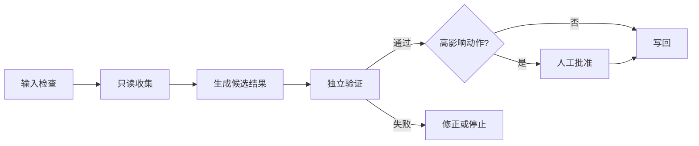

# 组合 Agent 工作流

## 1. 用边界清晰的步骤组合

一个稳健工作流通常拆成：收集输入、规范化、执行核心任务、独立验证、人工批准、发布或写回。每一步只负责一种结果，并通过文件或结构化数据传递。

## 2. 推荐模式

## 3. 接口契约

为每一步写明：输入字段、输出字段、允许的副作用、超时、重试次数、错误格式和验证命令。这样可以替换 Skill 而不破坏整个流程。

## 4. 不要让一个 Agent 包办全部

检索者、执行者和验证者可以使用不同提示、不同工具权限甚至不同模型。独立验证能减少同一错误在整条链路中被放大的概率。

## 5. 检查点

在网络发布、删除、付费、生产部署、账户权限和隐私数据处理之前设置硬性检查点。检查点必须能阻止后续步骤，而不只是显示提醒。
