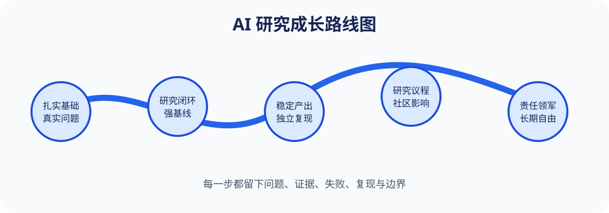

# 张明（zmz2）的愿望

> 一份真诚、具体、愿意接受时间检验的 AI 研究、人生与共同成长愿望单。

我希望中很多篇真正有价值的论文，成长为 AI 领域有独立判断、能承担责任、能够成就他人的领军人物。

我也真诚祝愿 LED 成为商业界有分量的计算机技术大牛：技术扎实、商业清醒、产品可信、团队温暖、长期成功，并始终保有健康、自由与内心踏实。

## 内容规模

- [主愿望单](./WISH_LIST.md)：120 个具体愿望，超过 1,000 行。
- [研究路线图](./attachments/01_RESEARCH_ROADMAP.md)：从 90 天闭环到五年以上研究议程。
- [论文管线](./attachments/02_PAPER_PIPELINE.md)：从选题到维护的九个质量 Gate。
- [AI 领军力记分卡](./attachments/03_AI_LEADERSHIP_SCORECARD.md)：不只看论文和职位。
- [90 天行动计划](./attachments/04_90_DAY_ACTION_PLAN.md)：把愿望翻译成一个研究闭环。
- [写给 LED 的祝愿书](./attachments/05_LED_BLESSING.md)。
- [41 个研究点子](./attachments/06_IDEA_BACKLOG.csv)。
- [阅读与实验日志模板](./attachments/07_READING_LOG_TEMPLATE.md)。
- 3 张原创 SVG 图示与[无障碍说明](./assets/README.md)。
- [内容清单与 SHA-256](./MANIFEST.md)。

## 这份愿望单不是什么

它不是对未来的保证，不是与别人比较的排行榜，也不是把论文接收、职位、收入或关注度当成唯一成功标准的清单。

## 这份愿望单是什么

它是把野心翻译成行动的工具。它允许我真诚承认自己想中很多篇论文、想成为 AI 领军人物，也提醒我：真正配得上这些愿望的，是可信证据、长期积累、对他人的尊重、对风险的承担，以及在无人监督时仍然诚实的选择。

愿 RoadOfFlower 因为每一次真实维护、可靠链接、可复现教程和善意祝福而持续开花。🌸
