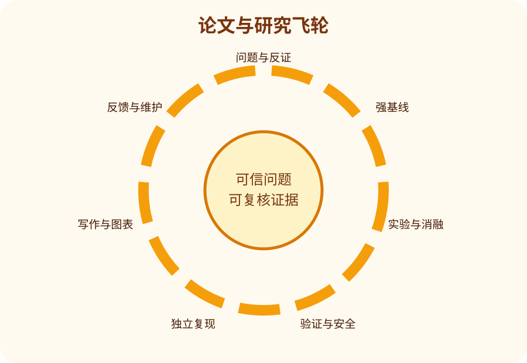

# 论文生产与质量管线

## Gate 0：问题池与停止条件

记录问题来源、目标用户、科学意义、已知解、反证条件和不做的理由。

### 通过条件

- 有可链接、可复查的证据，而不是口头确认。
- 阻断问题已解决，或明确降级主张与适用范围。
- 下一 Gate 的输入完整，版本和责任人明确。
- 失败时有停止、回滚或重设计决定。

### 常见拒绝原因

- 只有新模块，没有问题对应或机制假设。
- 与弱基线比较，或计算预算不公平。
- 只报告平均分，隐藏失败切片和不确定性。
- 引用与主张不匹配，或把相关性写成因果。
- 复现依赖未记录的文件、人工修改或私有知识。

## Gate 1：一页提案

用一页写清问题、核心假设、最小新意、强基线、主要指标、风险和预算。

### 通过条件

- 有可链接、可复查的证据，而不是口头确认。
- 阻断问题已解决，或明确降级主张与适用范围。
- 下一 Gate 的输入完整，版本和责任人明确。
- 失败时有停止、回滚或重设计决定。

### 常见拒绝原因

- 只有新模块，没有问题对应或机制假设。
- 与弱基线比较，或计算预算不公平。
- 只报告平均分，隐藏失败切片和不确定性。
- 引用与主张不匹配，或把相关性写成因果。
- 复现依赖未记录的文件、人工修改或私有知识。

## Gate 2：数据与评估审计

固定数据版本、拆分、泄漏检查、测量有效性、切片、正负对照和统计计划。

### 通过条件

- 有可链接、可复查的证据，而不是口头确认。
- 阻断问题已解决，或明确降级主张与适用范围。
- 下一 Gate 的输入完整，版本和责任人明确。
- 失败时有停止、回滚或重设计决定。

### 常见拒绝原因

- 只有新模块，没有问题对应或机制假设。
- 与弱基线比较，或计算预算不公平。
- 只报告平均分，隐藏失败切片和不确定性。
- 引用与主张不匹配，或把相关性写成因果。
- 复现依赖未记录的文件、人工修改或私有知识。

## Gate 3：基线复现

先复现简单基线和公开强基线；记录与原文差异，不能复现时停止吹嘘比较。

### 通过条件

- 有可链接、可复查的证据，而不是口头确认。
- 阻断问题已解决，或明确降级主张与适用范围。
- 下一 Gate 的输入完整，版本和责任人明确。
- 失败时有停止、回滚或重设计决定。

### 常见拒绝原因

- 只有新模块，没有问题对应或机制假设。
- 与弱基线比较，或计算预算不公平。
- 只报告平均分，隐藏失败切片和不确定性。
- 引用与主张不匹配，或把相关性写成因果。
- 复现依赖未记录的文件、人工修改或私有知识。

## Gate 4：主实验与消融

预先定义主要实验、机制中介量、消融和失败条件，避免结果后挑选。

### 通过条件

- 有可链接、可复查的证据，而不是口头确认。
- 阻断问题已解决，或明确降级主张与适用范围。
- 下一 Gate 的输入完整，版本和责任人明确。
- 失败时有停止、回滚或重设计决定。

### 常见拒绝原因

- 只有新模块，没有问题对应或机制假设。
- 与弱基线比较，或计算预算不公平。
- 只报告平均分，隐藏失败切片和不确定性。
- 引用与主张不匹配，或把相关性写成因果。
- 复现依赖未记录的文件、人工修改或私有知识。

## Gate 5：安全、鲁棒与压力测试

测试分布变化、恶意输入、工具失败、权限拒绝、隐私和不可逆副作用。

### 通过条件

- 有可链接、可复查的证据，而不是口头确认。
- 阻断问题已解决，或明确降级主张与适用范围。
- 下一 Gate 的输入完整，版本和责任人明确。
- 失败时有停止、回滚或重设计决定。

### 常见拒绝原因

- 只有新模块，没有问题对应或机制假设。
- 与弱基线比较，或计算预算不公平。
- 只报告平均分，隐藏失败切片和不确定性。
- 引用与主张不匹配，或把相关性写成因果。
- 复现依赖未记录的文件、人工修改或私有知识。

## Gate 6：独立复现

由未参与实现者在干净环境重跑核心结果，并记录所有需要询问的隐性知识。

### 通过条件

- 有可链接、可复查的证据，而不是口头确认。
- 阻断问题已解决，或明确降级主张与适用范围。
- 下一 Gate 的输入完整，版本和责任人明确。
- 失败时有停止、回滚或重设计决定。

### 常见拒绝原因

- 只有新模块，没有问题对应或机制假设。
- 与弱基线比较，或计算预算不公平。
- 只报告平均分，隐藏失败切片和不确定性。
- 引用与主张不匹配，或把相关性写成因果。
- 复现依赖未记录的文件、人工修改或私有知识。

## Gate 7：写作与图表冻结

建立主张—证据矩阵；逐句检查摘要、图表和结论是否超过证据。

### 通过条件

- 有可链接、可复查的证据，而不是口头确认。
- 阻断问题已解决，或明确降级主张与适用范围。
- 下一 Gate 的输入完整，版本和责任人明确。
- 失败时有停止、回滚或重设计决定。

### 常见拒绝原因

- 只有新模块，没有问题对应或机制假设。
- 与弱基线比较，或计算预算不公平。
- 只报告平均分，隐藏失败切片和不确定性。
- 引用与主张不匹配，或把相关性写成因果。
- 复现依赖未记录的文件、人工修改或私有知识。

## Gate 8：投稿、回应与长期维护

回应审稿时区分科学问题与叙事偏好；接收或拒稿后都维护代码、勘误和复现。

### 通过条件

- 有可链接、可复查的证据，而不是口头确认。
- 阻断问题已解决，或明确降级主张与适用范围。
- 下一 Gate 的输入完整，版本和责任人明确。
- 失败时有停止、回滚或重设计决定。

### 常见拒绝原因

- 只有新模块，没有问题对应或机制假设。
- 与弱基线比较，或计算预算不公平。
- 只报告平均分，隐藏失败切片和不确定性。
- 引用与主张不匹配，或把相关性写成因果。
- 复现依赖未记录的文件、人工修改或私有知识。

## 投稿前最终清单

- [ ] 标题与摘要没有超过证据。
- [ ] 所有主要数字可从原始输出重算。
- [ ] 图表标签、单位、样本量和误差说明完整。
- [ ] 数据、代码、环境和随机性可追溯。
- [ ] 负结果和限制没有被埋进附录。
- [ ] 许可证、隐私、伦理和安全边界已审查。
- [ ] 至少一名未参与实现者完成核心复现。
