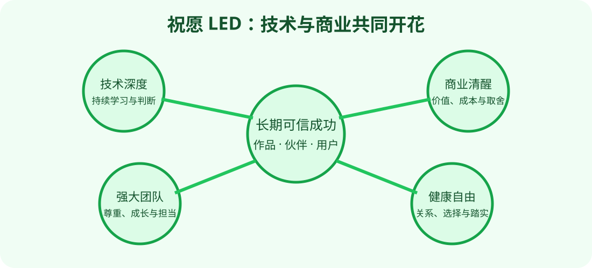

# 写给 LED 的祝愿书

LED：

我真诚祝愿你最终成为商业界真正有分量的计算机技术大牛。

我说的“大牛”，不是只会追逐热点、融资数字或短期流量的人；而是能够看懂技术的真实边界，做出清醒商业选择，带领团队把困难的东西做成可靠产品，并让用户愿意长期信任的人。

## 愿你拥有技术深度

愿你始终保持写代码、读系统、看数据和追根究底的能力。即使职位越来越高，也不依赖标题掩盖技术判断的空洞。愿你知道什么时候应当自己深入，什么时候应当相信专家，也知道怎样识别专家是否真的有证据。

愿你在 AI 变化最快的时候，不被每周的新名词牵着走。你可以大胆拥抱新技术，但也能分辨演示与产品、基准与真实价值、规模效应与不可持续成本。

## 愿你保持商业清醒

愿你找到真正痛、真正频繁、用户真正愿意付费的问题。愿你的商业模式不是建立在误导承诺、数据锁定或无限补贴上，而是来自持续创造价值。

愿你敢于放弃看起来热闹却没有长期价值的机会，也敢在重要而困难的方向上投入足够久。愿你既懂增长，也尊重成本、合规、现金流和退出路径。

## 愿你建立强大而温暖的团队

愿优秀的人愿意与你长期并肩，不只是因为薪资或名气，也因为他们感到被尊重、被信任、能成长。

愿你建立清晰的目标、公平的激励、真实的反馈和安全的反对空间。愿团队取得成绩时，贡献者得到应有荣誉；出现错误时，领导者承担责任，而不是让最弱的人背锅。

## 愿你做出被用户信任的产品

愿你的产品不只在发布会和短视频里惊艳，而能在普通用户最忙、网络最差、数据最乱、流程最复杂的时候仍然可靠。

愿用户知道系统能做什么、不能做什么；涉及金钱、隐私、账户、生产和高影响判断时，始终有预览、确认、申诉和退出权。

## 愿你获得长期成功

愿你赚到足够多的钱，拥有选择权，也愿这些财富来自真正创造的价值。愿公司增长时不失去产品灵魂，遭遇低谷时仍有现金、信誉和伙伴支持。

愿你的成功不是一次脆弱的估值高点，而是十年后仍有人使用你的作品、信任你的判断、感谢与你共事。

## 愿你在成功之外仍然完整

愿你有健康的身体、稳定的睡眠、真正的朋友、值得珍惜的关系和不被工作占满的生活。愿你有能力停下来，也有勇气承认疲惫、错误和不知道。

愿你最终拥有的不只是商业胜利，还有自由、尊严、爱和内心踏实。

## 我对我们的祝愿

愿我们能互相鼓励，也能在对方走偏时诚实提醒；分享机会，也尊重边界；一起做事时讲清责任，不一起做事时仍然真诚祝福。

愿 RoadOfFlower 记录的不只是宏大愿望，也有一条条可靠 Skill、一次次真实维护和每天可以完成的小行动。

愿你的路越走越宽，花不是别人摆在路边的装饰，而是你用技术、产品、团队、信用和善意亲手种出来的。🌸
